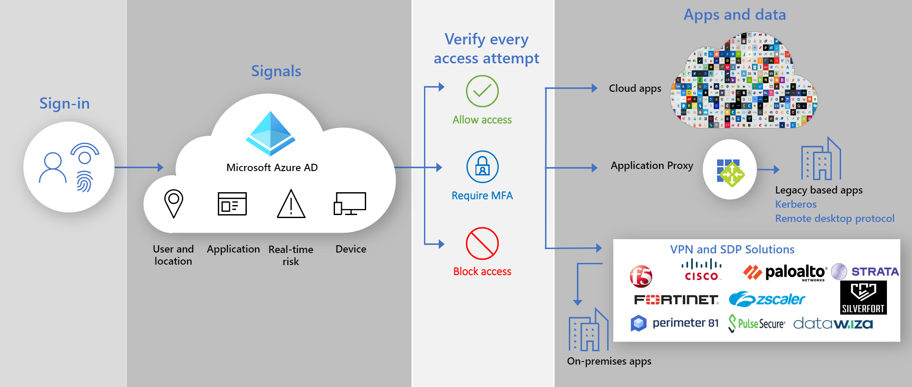

# Secure hybrid access: Secure legacy apps with Azure Active Directory

You can now protect your on-premises and cloud legacy authentication applications by connecting them to Azure Active Directory (AD) with:

- [Azure AD Application Proxy](#secure-hybrid-access-sha-through-azure-ad-application-proxy)

- [Your existing application delivery controllers and networks](#sha-through-networking-and-delivery-controllers)

- [Virtual Private Network (VPN) and Software-Defined Perimeter (SDP) applications](#sha-through-vpn-and-sdp-applications)

You can bridge the gap and strengthen your security posture across all applications with Azure AD capabilities like Azure AD [Conditional Access](../conditional-access/overview.md) and Azure AD [Identity Protection](../identity-protection/overview-identity-protection.md).

## Secure hybrid access (SHA) through Azure AD Application Proxy
  
Using [Application Proxy](./what-is-application-proxy.md) you can provide [secure remote access](./application-proxy.md) to your on-premises web applications. Your users don’t require to use a VPN. Users benefit by easily connecting to their applications from any device after a [single sign-on](./add-application-portal-setup-sso.md). Application Proxy provides remote access as a service and allows you to [easily publish your on-premise applications](./application-proxy-add-on-premises-application.md) to users outside the corporate network. It helps you scale your cloud access management without requiring you to modify your on-premises applications. [Plan an Azure AD Application Proxy deployment](./application-proxy-deployment-plan.md) as a next step.

## Azure AD partner integrations

### SHA through networking and delivery controllers

In addition to [Azure AD Application Proxy](./what-is-application-proxy.md), to enable you to use the [Zero Trust framework](https://www.microsoft.com/security/blog/2020/04/02/announcing-microsoft-zero-trust-assessment-tool/), Microsoft partners with third-party providers. You can use your existing networking and delivery controllers, and easily protect legacy applications that are critical to your business processes but that you couldn’t protect before with Azure AD. It’s likely you already have everything you need to start protecting these applications.

The following networking vendors offer pre-built solutions and detailed guidance for integrating with Azure AD.

- [Akamai Enterprise Application Access (EAA)](https://docs.microsoft.com/azure/active-directory/saas-apps/akamai-tutorial)

- [Citrix Application Delivery Controller (ADC)](https://docs.microsoft.com/azure/active-directory/saas-apps/citrix-netscaler-tutorial)

- [F5 Big-IP APM](https://docs.microsoft.com/azure/active-directory/manage-apps/f5-aad-integration)

- [Kemp](https://docs.microsoft.com/azure/active-directory/saas-apps/kemp-tutorial)

- [Pulse Secure Virtual Traffic Manager (VTM)](https://docs.microsoft.com/azure/active-directory/saas-apps/pulse-secure-virtual-traffic-manager-tutorial)

### SHA through VPN and SDP applications

Using VPN  and SDP solutions you can provide secure access to your enterprise network from any device, at any time, in any location while protecting your organization’s data. By having Azure AD as an Identity provider (IDP), you can use modern authentication and authorization methods like Azure AD [Single sign-on](./what-is-single-sign-on.md) and [Multi-factor authentication](../authentication/concept-mfa-howitworks.md) to secure your on-premises legacy applications.  

The following VPN vendors offer pre-built solutions and detailed guidance for integrating with Azure AD.

- [Cisco AnyConnect](https://docs.microsoft.com/azure/active-directory/saas-apps/cisco-anyconnect)

- [Fortinet](https://docs.microsoft.com/azure/active-directory/saas-apps/fortigate-ssl-vpn-tutorial)

- [F5 Big-IP APM](https://docs.microsoft.com/azure/active-directory/manage-apps/f5-aad-password-less-vpn)

- [Palo Alto Networks Global Protect](https://docs.microsoft.com/azure/active-directory/saas-apps/paloaltoadmin-tutorial)

- [Pulse Secure Pulse Connect Secure (PCS)](https://docs.microsoft.com/azure/active-directory/saas-apps/pulse-secure-pcs-tutorial)

The following SDP vendors offer pre-built solutions and detailed guidance for integrating with Azure AD.

- [Datawiza Access Broker](https://docs.microsoft.com/azure/active-directory/manage-apps/add-application-portal-setup-oidc-sso)

- [Perimeter 81](https://docs.microsoft.com/azure/active-directory/saas-apps/perimeter-81-tutorial#:~:text=For%20SSO%20to%20work,%20you%20need%20to%20establish,to%20test%20Azure%20AD%20single%20sign-on%20with%20B.Simon.)

- [Silverfort Authentication Platform](https://docs.microsoft.com/azure/active-directory/manage-apps/add-application-portal-setup-oidc-sso)

- [Strata](https://docs.microsoft.com/azure/active-directory/saas-apps/maverics-identity-orchestrator-saml-connector-tutorial)

- [Zscaler Private Access (ZPA)](https://docs.microsoft.com/azure/active-directory/saas-apps/zscalerprivateaccess-tutorial)
