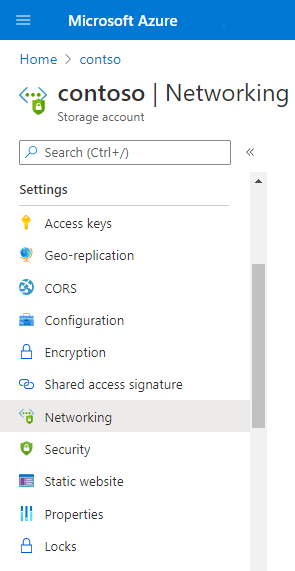
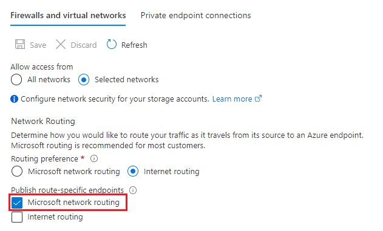
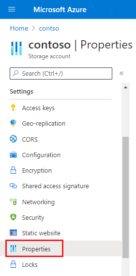
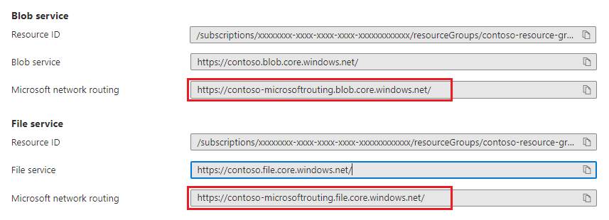

# Configure network routing preference for Azure Storage

This article describes how you can configure the network routing preference and route-specific endpoints for your storage account. 

The network routing preference specifies how network traffic is routed to your account from clients over the internet. Route-specific endpoints are new endpoints that Azure Storage creates for your storage account. These endpoints route traffic over a desired path without changing your default routing preference. To learn more, see [Network routing preference for Azure Storage](network-routing-preference.md).

## Configure the routing preference for the default public endpoint

By default, the routing preference for the public endpoint of the storage account is set to Microsoft global network. You can choose between the Microsoft global network and Internet routing as the default routing preference for the public endpoint of your storage account. To learn more about the difference between these two types of routing, see [Network routing preference for Azure Storage](network-routing-preference.md). 

To change your routing preference to Internet routing:

1. Navigate to your storage account in the portal.

2. Under **Settings**, choose **Networking**.

    > [!div class="mx-imgBorder"]
    > 

3.	In the **Firewalls and virtual networks** tab, under **Network Routing**, change the **Routing preference** setting to **Internet routing**.

4.	Click **Save**.

    > [!div class="mx-imgBorder"]
    > 

## Configure a route-specific endpoint

You can also configure a route-specific endpoint. For example, you can set the routing preference for the default endpoint to *Internet routing*, and then publish a route-specific endpoint that enables traffic between clients on the internet and your storage account to be routed via the Microsoft global network.

1.	Navigate to your storage account in the portal.

2.	Under **Settings**, choose **Networking**.

3.	In the **Firewalls and virtual networks** tab, under **Publish route-specific endpoints**, choose the routing preference of your route-specific endpoint, and then click **Save**. This preference affects only the route-specific endpoint. This preference doesn't affect your default routing preference.  

    The following image shows the **Microsoft network routing** option selected.

    > [!div class="mx-imgBorder"]
    > 

## Find the endpoint name for a route-specific endpoint

If you configured a route-specific endpoint, you can find the endpoint in the properties of you storage account.

1.	Under **Settings**, choose **Properties**.

    > [!div class="mx-imgBorder"]
    > 

2.	The **Microsoft network routing** endpoint is shown for each service that supports routing preferences. This image shows the endpoint for the blob and file services.

    > [!div class="mx-imgBorder"]
    > 

## See also

- [Network routing preference](network-routing-preference.md)
- [Configure Azure Storage firewalls and virtual networks](storage-network-security.md)
- [Security recommendations for Blob storage](../blobs/security-recommendations.md)
